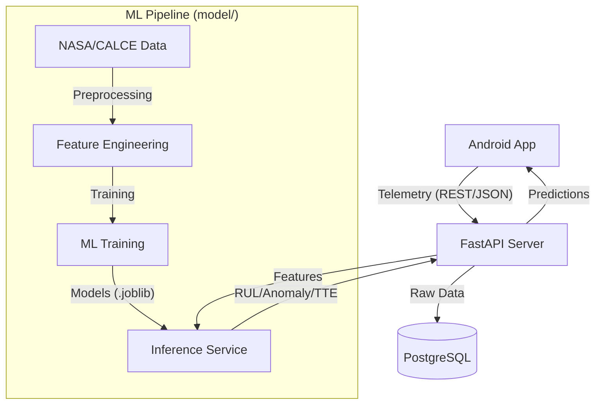

# Battery Manager — AI Backend & ML Pipeline

[](https://fastapi.tiangolo.com/)
[](https://www.python.org/)
[](https://xgboost.ai/)
[](https://www.postgresql.org/)

**Battery Manager** is an end-to-end AI-powered system designed to monitor, analyze, and optimize battery health for mobile devices. This repository houses the **Machine Learning Pipeline** and the **Production-Ready FastAPI Backend**, which together provide the intelligence layer for the [Battery Manager Android application](file:///media/lenovo/New%20Volume1/Programming/App_Dev/Battery_Manager_Backend_and_Model/Battery_Manager_Documentation.md).

---

## 🛠️ Technology Stack

### **Backend (server/)**
- **Framework**: [FastAPI](https://fastapi.tiangolo.com/) (Asynchronous Python)
- **Database**: [PostgreSQL](https://www.postgresql.org/) with [TimescaleDB](https://www.timescale.com/) for time-series optimization.
- **ORM**: [SQLAlchemy](https://www.sqlalchemy.org/) (Async) with [Alembic](https://alembic.sqlalchemy.org/) for migrations.
- **Validation**: [Pydantic v2](https://docs.pydantic.dev/latest/) for request/response schemas.
- **ML Serving**: [Joblib](https://joblib.readthedocs.io/) for loading serialized models.
- **Containerization**: [Docker](https://www.docker.com/) & [Docker Compose](https://docs.docker.com/compose/).

### **Machine Learning (model/)**
- **Core Libraries**: `scikit-learn`, `XGBoost`, `Pandas`, `NumPy`.
- **Deep Learning**: `PyTorch` (for TTE LSTM models).
- **Tracking**: [MLflow](https://mlflow.org/) for experiment logging and model registry.
- **Notebooks**: `Jupyter` & `Marimo` for interactive data exploration.
- **Feature Engineering**: Custom signal processing pipeline for battery degradation analysis.

---

## 🏗️ System Architecture

The project is architected as a two-layer intelligence system:

1.  **The Brain (`model/`)**: A comprehensive ML pipeline for feature engineering, model training, and experiment tracking. It utilizes high-fidelity datasets (NASA, CALCE, Stanford, Toyota) to build models that predict battery degradation with extreme accuracy.
2.  **The Gateway (`server/`)**: A high-performance FastAPI backend that serves these models, ingests real-time telemetry from thousands of devices, and provides actionable insights via REST endpoints.



---

## 📂 Project Deep Dive

### 🧠 [model/](file:///media/lenovo/New%20Volume1/Programming/App_Dev/Battery_Manager_Backend_and_Model/model) — The Machine Learning Pipeline

The `model` directory contains the core intelligence of the system. It is responsible for transforming raw battery signals into predictive insights.

#### Key Components:
- **[features/](file:///media/lenovo/New%20Volume1/Programming/App_Dev/Battery_Manager_Backend_and_Model/model/features)**:
    - `aggregators.py`: Computes statistical summaries (mean, std, max) over charging/discharging cycles.
    - `cycle_life.py`: Extracts cycle-based features like charge/discharge capacity and efficiency.
    - `degradation.py`: Computes long-term degradation signals (SOH loss per 100 cycles).
    - `engineering.py`: The master feature engineering script that combines all signals into a flat feature vector.
- **[models/](file:///media/lenovo/New%20Volume1/Programming/App_Dev/Battery_Manager_Backend_and_Model/model/models)**:
    - **RUL (Remaining Useful Life)**: Uses an **XGBoost Regressor** to predict the number of cycles remaining before a battery reaches 80% capacity.
    - **Anomaly Detection**: Uses **Isolation Forest** to identify anomalous battery behavior (e.g., internal shorts or thermal issues) and explains the cause via feature deviation analysis.
    - **TTE (Time-to-Empty)**: Uses an **LSTM (Long Short-Term Memory)** network to forecast remaining battery time based on recent time-series usage data.
    - **Clustering**: Uses **K-Means** to categorize user behavior into archetypes (e.g., "Overnight Charger", "Power User").
- **[training/](file:///media/lenovo/New%20Volume1/Programming/App_Dev/Battery_Manager_Backend_and_Model/model/training)**:
    - `pipeline.py`: Orchestrates the full training process from data loading to model export.
    - `mlflow_logger.py`: Integrates with **MLflow** for experiment tracking and model versioning.
    - `hyperparameter_tuning.py`: Uses Optuna/GridSearch to optimize model performance.
- **[notebooks/](file:///media/lenovo/New%20Volume1/Programming/App_Dev/Battery_Manager_Backend_and_Model/model/notebooks)**: Contains detailed data exploration and prototyping for the RUL and Anomaly models.

---

### 📡 [server/](file:///media/lenovo/New%20Volume1/Programming/App_Dev/Battery_Manager_Backend_and_Model/server) — The Production Backend

The `server` directory contains the FastAPI application that bridges the gap between the mobile app and the ML models.

#### Core Modules:
- **[app/api/v1/](file:///media/lenovo/New%20Volume1/Programming/App_Dev/Battery_Manager_Backend_and_Model/server/app/api/v1)**:
    - `predict.py`: Endpoint for real-time RUL and SOH predictions.
    - `telemetry/`: Endpoints for ingesting raw battery data and retrieving usage statistics.
    - `anomaly/`: Endpoints for checking if a specific battery cycle was anomalous.
    - `advice/`: Endpoints for receiving personalized AI charging recommendations.
- **[app/models/](file:///media/lenovo/New%20Volume1/Programming/App_Dev/Battery_Manager_Backend_and_Model/server/app/models)**:
    - `ml_model.py`: A unified wrapper that loads `.joblib` models and provides a consistent `predict()` interface.
    - `anomaly/`: Houses the `AnomalyDetector` class, which combines the Isolation Forest model with an explanation engine.
- **[app/services/](file:///media/lenovo/New%20Volume1/Programming/App_Dev/Battery_Manager_Backend_and_Model/server/app/services)**:
    - `telemetry_service.py`: Handles database operations for raw telemetry data.
    - `prediction_service.py`: Orchestrates feature extraction from raw data before passing it to the ML models.
    - `llm_service.py`: (Planned) Uses LLMs to generate human-readable advice from ML insights.
- **[app/database/](file:///media/lenovo/New%20Volume1/Programming/App_Dev/Battery_Manager_Backend_and_Model/server/app/database)**:
    - `schemas.py`: Defines the SQLAlchemy models for the PostgreSQL database (using **TimescaleDB** for time-series optimization).

#### 💡 The AI Advice System
The backend integrates ML insights with an LLM-powered advisory layer (planned) to provide users with specific actions:
1.  **Habit Detection**: K-Means clustering identifies risky charging patterns.
2.  **Insight Generation**: RUL and Anomaly models provide quantitative health data.
3.  **Actionable Advice**: The `LLMService` transforms "85% SOH with 2.5% monthly loss" into "Avoid overnight charging to extend your battery life by 4 months."

---

## 📊 Database Schema (Telemetry)

The system stores high-frequency telemetry data in the `battery_telemetry_raw` table, optimized for time-series queries.

| Field | Type | Description |
|---|---|---|
| `time` | `TIMESTAMP` | Primary key (partitioned) |
| `device_id` | `VARCHAR(64)` | Unique identifier for the device |
| `level_percent` | `INTEGER` | Battery charge level (0-100) |
| `voltage_v` | `FLOAT` | Current battery voltage |
| `current_ma` | `INTEGER` | Instantaneous current flow |
| `temperature_c` | `FLOAT` | Battery temperature in Celsius |
| `health_percent` | `FLOAT` | Estimated SOH (State of Health) |
| `cycle_count` | `INTEGER` | Total charge cycles accumulated |
| `foreground_app` | `VARCHAR(256)`| Current app being used (for drain attribution) |

---

## 📡 Telemetry Data Flow

1.  **Android App**: Collects high-frequency signals (voltage, current, temperature) via the Kotlin `BatteryManager` bridge.
2.  **Ingestion**: Telemetry is sent to the `POST /api/v1/telemetry/ingest` endpoint.
3.  **Persistence**: The `TelemetryService` saves raw readings into the **TimescaleDB** optimized `battery_telemetry_raw` table.
4.  **Inference**: When the app requests an update (`/api/v1/inference`), the `PredictionService` fetches recent readings, extracts features, and runs them through the loaded ML models.
5.  **Feedback**: The user receives real-time updates on their SOH, RUL, and any detected anomalies.

---

## � Getting Started

### Prerequisites
- Python 3.9 or higher
- PostgreSQL (TimescaleDB extension recommended)
- [Optional] Docker and Docker Compose

### Local Installation
1.  **Clone the repository**:
    ```bash
    git clone https://github.com/your-repo/battery-manager-backend.git
    cd battery-manager-backend
    ```

2.  **Set up the environment**:
    ```bash
    cp .env.example .env  # Update with your DB credentials
    ```

3.  **Install dependencies**:
    ```bash
    # For the ML pipeline
    pip install -r model/requirements.txt
    
    # For the API backend
    pip install -r server/requirements.txt
    ```

4.  **Run the Backend**:
    ```bash
    cd server
    python run.py
    ```
    The API will be live at `http://localhost:8000`. Explore the documentation at `http://localhost:8000/docs`.

### Docker Deployment
```bash
cd server
docker-compose up --build
```

---

## 🌲 Project Tree
```text
.
├── Battery_Manager_Documentation.md  ← Concept & App documentation
├── model/                             ← ML Pipeline Source
│   ├── features/                      ← Feature Engineering
│   ├── models/                        ← Model Architectures (RUL, Anomaly, TTE)
│   ├── training/                      ← Training Orchestration (MLflow)
│   ├── inference/                     ← Prediction Services
│   └── notebooks/                     ← Prototyping & EDA
├── server/                            ← FastAPI Backend Source
│   ├── app/
│   │   ├── api/v1/                    ← Endpoints & Schemas
│   │   ├── core/                      ← App Config & DB Connection
│   │   ├── database/                  ← SQLAlchemy Models
│   │   ├── models/                    ← Model Integration Wrappers
│   │   └── services/                  ← Business Logic
│   ├── Dockerfile
│   ├── docker-compose.yml
│   └── run.py                         ← Server Entry Point
└── README.md                          ← You are here
```

---

## 🛡️ License
This project is licensed for internal development and research purposes. All datasets (NASA, CALCE) belong to their respective institutions.
