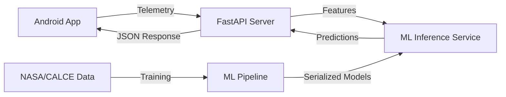

# Battery Manager — AI Backend & ML Pipeline

### Project Overview
**Battery Manager** is an advanced AI-powered system designed to analyze, monitor, and optimize battery health for mobile devices. This repository contains the **Machine Learning Pipeline** and the **FastAPI Backend** that provide intelligence to the [Battery Manager Android app](file:///media/lenovo/New%20Volume1/Programming/App_Dev/Battery_Manager_Backend_and_Model/Battery_Manager_Documentation.md).

It solves the limitations of standard OS battery reports by providing:
- **Precise RUL (Remaining Useful Life)**: Predicts when a battery will reach 80% capacity (end-of-life).
- **Anomaly Detection**: Identifies unusual patterns (e.g., sudden voltage drops or thermal issues).
- **TTE (Time-to-Empty)**: Real-time discharge forecasting based on current usage habits.
- **Charging Advice**: Personalized recommendations to extend battery longevity.

---

## 🏗️ System Architecture

The project is divided into two primary modules:

1.  **`model/` (The Brain)**: A full ML pipeline for feature engineering, training, and experiment tracking. It uses datasets like NASA, CALCE, and Stanford to build robust battery degradation models.
2.  **`server/` (The Gateway)**: A production-ready FastAPI backend that exposes these models via a REST API, handles device registration, and processes telemetry data.



---

## 📂 Directory Structure

### [model/](file:///media/lenovo/New%20Volume1/Programming/App_Dev/Battery_Manager_Backend_and_Model/model) — Machine Learning Pipeline
- **[features/](file:///media/lenovo/New%20Volume1/Programming/App_Dev/Battery_Manager_Backend_and_Model/model/features)**: Signal processing and feature extraction (aggregators, cycle life, degradation).
- **[inference/](file:///media/lenovo/New%20Volume1/Programming/App_Dev/Battery_Manager_Backend_and_Model/model/inference)**: Unified prediction interface used by the backend.
- **[training/](file:///media/lenovo/New%20Volume1/Programming/App_Dev/Battery_Manager_Backend_and_Model/model/training)**: Orchestrates model training and hyperparameter tuning with MLflow.
- **[notebooks/](file:///media/lenovo/New%20Volume1/Programming/App_Dev/Battery_Manager_Backend_and_Model/model/notebooks)**: Data exploration and prototyping for RUL and Anomaly models.
- **[utils/](file:///media/lenovo/New%20Volume1/Programming/App_Dev/Battery_Manager_Backend_and_Model/model/utils)**: Metrics, validation, and constants used across the pipeline.

### [server/](file:///media/lenovo/New%20Volume1/Programming/App_Dev/Battery_Manager_Backend_and_Model/server) — FastAPI Backend
- **[app/api/v1/](file:///media/lenovo/New%20Volume1/Programming/App_Dev/Battery_Manager_Backend_and_Model/server/app/api/v1)**: Versioned REST endpoints and Pydantic schemas.
- **[app/core/](file:///media/lenovo/New%20Volume1/Programming/App_Dev/Battery_Manager_Backend_and_Model/server/app/core)**: Global configuration and environment settings.
- **[app/models/](file:///media/lenovo/New%20Volume1/Programming/App_Dev/Battery_Manager_Backend_and_Model/server/app/models)**: ML model wrappers and database models.
- **[app/services/](file:///media/lenovo/New%20Volume1/Programming/App_Dev/Battery_Manager_Backend_and_Model/server/app/services)**: Business logic (ingestion and prediction orchestration).
- **[run.py](file:///media/lenovo/New%20Volume1/Programming/App_Dev/Battery_Manager_Backend_and_Model/server/run.py)**: Entry point for starting the development server.

---

## 🚀 Quick Start

### 1. Prerequisites
- Python 3.9+
- Docker & Docker Compose (optional)

### 2. Local Setup
```bash
# Clone the repository
git clone <repo-url>
cd Battery_Manager_Backend_and_Model

# Install model dependencies
pip install -r model/requirements.txt

# Install server dependencies
pip install -r server/requirements.txt
```

### 3. Run the Backend
```bash
cd server
python run.py
```
The API will be available at `http://localhost:8000`. Visit `http://localhost:8000/docs` for interactive documentation.

### 4. Run the ML Pipeline (Training)
```bash
# Set up MLflow for tracking
mlflow ui &

# Run the training pipeline
python -m model.training.pipeline
```

---

## 🧠 ML Pipeline Details

The system uses four main AI features to provide a complete picture of battery health:

1.  **RUL (Remaining Useful Life)**:
    -   **Model**: XGBoost Regressor.
    -   **Features**: Capacity fade, internal resistance, charge/discharge efficiency.
    -   **Dataset**: NASA Randomized Battery Dataset & CALCE.

2.  **Anomaly Detection**:
    -   **Model**: Isolation Forest (unsupervised).
    -   **Goal**: Detect thermal runaway signatures and voltage imbalances.

3.  **TTE (Time-to-Empty)**:
    -   **Model**: LSTM (Long Short-Term Memory).
    -   **Goal**: Predict remaining battery minutes based on time-series usage data.

4.  **Clustering (Habit Analysis)**:
    -   **Model**: K-Means.
    -   **Goal**: Categorize users (e.g., "Overnight Charger", "Power User") to provide tailored advice.

---

## 📡 Backend API Reference

### Endpoints (v1)
- `POST /api/v1/register`: Register a new device and receive an authentication token.
- `POST /api/v1/sessions`: Upload battery session telemetry (voltage, current, temperature).
- `POST /api/v1/inference`: Get real-time RUL, Anomaly, and TTE predictions for a device.
- `GET /health`: Basic health check for the API and loaded ML models.

### Data Flow
1.  **Ingestion**: Mobile app sends raw telemetry to `/sessions`.
2.  **Processing**: [prediction_service.py](file:///media/lenovo/New%20Volume1/Programming/App_Dev/Battery_Manager_Backend_and_Model/server/app/services/prediction_service.py) normalizes the data.
3.  **Inference**: [ml_model.py](file:///media/lenovo/New%20Volume1/Programming/App_Dev/Battery_Manager_Backend_and_Model/server/app/models/ml_model.py) loads the latest `.joblib` model and runs predictions.
4.  **Feedback**: The app receives a detailed [InferenceResponse](file:///media/lenovo/New%20Volume1/Programming/App_Dev/Battery_Manager_Backend_and_Model/server/app/api/v1/schemas/battery.py).

---

## 🐳 Deployment (Docker)

To run the entire system in a containerized environment:

```bash
cd server
docker-compose up --build
```
This starts the FastAPI server with hot-reloading enabled for development.

---

## 🛠️ Development Guide

### Adding a New Model
1.  Define the model architecture in [model/training/](file:///media/lenovo/New%20Volume1/Programming/App_Dev/Battery_Manager_Backend_and_Model/model/training).
2.  Export the trained model to `server/models/`.
3.  Update [ml_model.py](file:///media/lenovo/New%20Volume1/Programming/App_Dev/Battery_Manager_Backend_and_Model/server/app/models/ml_model.py) to include the new model's loading and prediction logic.

### Modifying API Schemas
1.  Edit [battery.py](file:///media/lenovo/New%20Volume1/Programming/App_Dev/Battery_Manager_Backend_and_Model/server/app/api/v1/schemas/battery.py) to update request/response models.
2.  The changes will automatically propagate to the `/docs` UI.

---

## 📄 License
This project is for internal development and research. All battery datasets (NASA, CALCE) are subject to their respective institutional licenses.

---

## 🌲 Project Tree
```text
.
├── Battery_Manager_Documentation.md
├── model
│   ├── config.py
│   ├── features
│   │   ├── aggregators.py
│   │   ├── cycle_life.py
│   │   ├── degradation.py
│   │   ├── engineering.py
│   │   └── __init__.py
│   ├── inference
│   │   ├── batch_processor.py
│   │   ├── cache.py
│   │   ├── __init__.py
│   │   └── service.py
│   ├── __init__.py
│   ├── __marimo__
│   │   └── session
│   │       └── notebook.py.json
│   ├── models
│   │   ├── anomaly
│   │   │   ├── autoencoder.py
│   │   │   ├── detect.py
│   │   │   ├── __init__.py
│   │   │   ├── saved_models
│   │   │   └── train.py
│   │   ├── clustering
│   │   │   ├── assign.py
│   │   │   ├── __init__.py
│   │   │   ├── saved_models
│   │   │   └── train.py
│   │   ├── __init__.py
│   │   ├── rul
│   │   │   ├── evaluate.py
│   │   │   ├── __init__.py
│   │   │   ├── predict.py
│   │   │   ├── saved_models
│   │   │   └── train.py
│   │   └── tte
│   │       ├── __init__.py
│   │       ├── lstm_model.py
│   │       ├── predict.py
│   │       ├── saved_models
│   │       └── train.py
│   ├── notebooks
│   │   ├── anomaly
│   │   │   ├── calec_data_exploration.ipynb
│   │   │   └── calec_model_preparation.ipynb
│   │   ├── __marimo__
│   │   │   └── session
│   │   └── rul
│   │       ├── nasa_data_exploration.py
│   │       ├── prepare_rul_data.ipynb
│   │       └── prepare_rul_data.py
│   ├── README.md
│   ├── requirements.txt
│   ├── tests
│   │   ├── __init__.py
│   │   ├── test_anomaly.py
│   │   ├── test_features.py
│   │   └── test_rul_model.py
│   ├── training
│   │   ├── cross_validation.py
│   │   ├── hyperparameter_tuning.py
│   │   ├── __init__.py
│   │   ├── mlflow_logger.py
│   │   └── pipeline.py
│   └── utils
│       ├── constants.py
│       ├── __init__.py
│       ├── metrics.py
│       ├── validation.py
│       └── visualization.py
├── README.md
└── server
    ├── app
    │   ├── api
    │   │   ├── __init__.py
    │   │   └── v1
    │   ├── core
    │   │   ├── config.py
    │   │   └── __init__.py
    │   ├── __init__.py
    │   ├── main.py
    │   ├── models
    │   │   ├── anomaly
    │   │   ├── clustering
    │   │   ├── __init__.py
    │   │   ├── ml_model.py
    │   │   ├── rul
    │   │   └── tte
    │   └── services
    │       ├── __init__.py
    │       └── prediction_service.py
    ├── docker-compose.yml
    ├── Dockerfile
    ├── requirements.txt
    └── run.py
```
